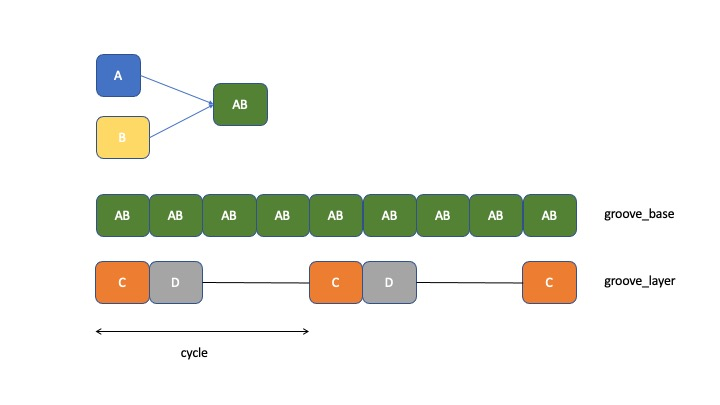

Advanced Grooving
-----------------

For this tutorial, it will be assumed that the user has compiled their own inventory of samples. The voicings given here are purely illustrative and should be adapted to fit the user's own library organisation.

This tutorial will use two new algorithms `Basic.groove` and `Solo.multivoice_serial_ordered`. It also reuses the `Mix.multitrack` algorithm to integrate each component part back into a whole.
   
Creating the composer control file
^^^^^^^^^^^^^^^^^^^^^^^^^^^^^^^^^^

The new composer control file is more complex, but follows a layering pattern with which you should now be familiar:

.. code-block:: json

   {
       "Basic" : {
           "groove" : {
               "tracks" : 50,
               "cycle" : 4,
               "voices" : [
                   "Bass",
                   "Beat",
                   "Percussion",
                   "Pad"
	       ]
           }
       },
       "Solo" : {
           "multivoice_serial_ordered" : {
               "tracks" : 50,
               "voices" : [
                   "Synth",
                   "Synth",
                   "Piano",
                   "Vox",
                   "Synth",
                   "Synth"
	       ]
           }
       },
       "Mix" : {
           "multitrack" : {
               "tracks" : 30,
               "voices" : [
                   "Basic",
		   "Solo"
	       ]
           }
       },
       "Globals" : {
           "destination" : "<your path here>",
           "tsize" : "s",
           "sequence" : [
	       "Basic",
               "Solo",
               "Mix"
           ]
       }
   }

Global variables
^^^^^^^^^^^^^^^^

The **Globals** section has a new parameter which allows you to roughly control the overall length of the tracks in your compositions. These are specified in t-shirt sizes and are currently defined in seconds thus:

.. code-block:: python

   TSHIRT = {
       "s" : 180,
       "m" : 300,
       "l" : 480,
       "xl" : 780,
       "xxl" : 1260,
       "xxxl" : 2640
    }

So a `tsize` of "s" represents a soft threshold of 3 minutes +/- 10% (calculated at runtime). This is a "soft" threshold because the final length of any track will be determined by the width of the segments used and the number of repeats that can be concatenated before the overall track length exceeds the limit. It is a very approximate threshold and merely represents a promise to keep the track within an order of magnitude. Hence the use of a t-shirt sizing metaphor for approximation.

As before, the `sequence` list specifies the order in which to execute the layers, so that outputs from early layers are available to be selected into the final micx layers.

Basic.groove
^^^^^^^^^^^^

The `Basic.groove` algorithm is used to form a rhythmic backbone to the composition. The configuration here will look very similar to the `Basic.voices3` used in the earlier tutorial, but the algorithm is more sophisticated and general purpose.

The number of voices can be 3 or more. For this example I am using 4, which we can think of as **A**, **B**, **C** and **D** corresponding to their declaration position in the configuration list.

Segments **A** and **B** are randomly selected from their inventory categories. These are then length-aligned. That is, whichever is the shorter of the two is padded with exactly the right amount of silence to make the frame lengths of both segments equal. These are then overlayed to form a composite rhythmic unit referred to as **AB**.

The basic rhythmic beat is created by replicating a sequence of these **AB** segments end-to-end until the track size limit is surpassed. This is the `groove_base`.

The `cycle` parameter specifies the number of these **AB** components tahe represent a higher level repetition unit called the `cycle` (obviously).

Subsequent voices are also length-aligned (or curtailed) to match the size of the **AB** unit. A new segment, `groove_layer` is created, into which the later voices **C**, **D**, etc. are injected in a cyclic sequence, aligned precisely to the `groove_base` cycles and beats.

Finally, the `groove_base` is overlayed with the `groove_layer` to create a composite whole track which is output as an audio file.

Solo.multivoice_serial_ordered
^^^^^^^^^^^^^^^^^^^^^^^^^^^^^^

This algorithm, as its name should indicate, is just one possible approach amongst a whole forest of potential variants. As such it is provided merely as an exemplar and starting point for the user's own explorations into algorithmic creativity.

Each of the voices in the configuration list is randomly selected from their inventory categories. At this point we have a fixed selection of solo voices for the rest of the track composition.

For each voice in sequence, the selected segment is padded with silence both front and back in a randomised non-uniform manner. The resulting segment is appended to the solo track and the sequence cycled until the track length exceeds its soft limit. This will be of the same order of magnitude as the limit used in the `Basic.groove` algorithm, but not identical or coupled in any way.

The solos are then output as audio files, existing independently.

Clearly, for an "s" sized track, setting 24 voices in the configuration is likely to result in a lot of redundant voicings that just never appear in the final track. Conversely, building an "xxl" solo out of just one or two voices will get very repetitive and uninteresting over time.

Mix.multitrack
^^^^^^^^^^^^^^

This performs the same function it did in the earlier basic workflow tutorial, combining randomly selected tracks from the generated `Basic` and `Solo` populations and generating audio output files of the results.

