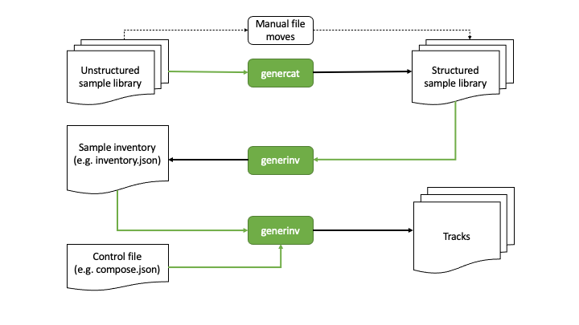

Basic Workflow
--------------

This text uses MacOS/Linux-style pathnames generally. The code has been written such that it should also support DOS-style paths in a Windows-based command shell. Key differences will be highlighted when they occur.

To illustrate this workflow with a worked example, I am going to create a very small sample library under `/tmp/samples` using the WAV samples provided `Archive.org`_.
Note that the "GenerIter_Demo_Track" files should be moved into a different directory outside the `/tmp/samples` tree as they are not used here.

The core **GenerIter** process is illustrated in the diagram:

The basic workflow breaks down into 4 phases:

    #. Categorising the sample library
    #. Creating the sample inventory
    #. Creating the composer control file
    #. Generating music

Categorising the sample library
^^^^^^^^^^^^^^^^^^^^^^^^^^^^^^^

This first phase assumes the you starts with an unstructured set of samples in youre directory.

To make the most out of the inventory classification system, it helps if the samples are organised in subdirectories named after the categories the composer finds useful. These category names can be clompletely arbitrary, but for this illustration I am going to use musical voice/instrument category specifiers like "Drums", "Bass", "Synths", etc.

The good news is that these categories can be specified at any level in your sample tree and don't require the "Drums" samples, for example to all be in a single directory.

The genercat_ utility is a helper command that allows the composer to allocate sets of sample files into named subdirectories, where the names of those directories will ultimately correspond to the categories in the inventory.

To illustrate this workflow with a worked example, I am going to create a very small sample library under `/tmp/samples` using the WAV samples I downloaded from `Archive.org`_:

.. code-block:: bash

   cd /tmp/samples
   .
   ├── Bass_1.wav
   ├── Bass_2.wav
   ├── Bass_3.wav
   ├── Beats_1.wav
   ├── Beats_2.wav
   ├── Beats_3.wav
   ├── Drone_1.wav
   ├── Drone_2.wav
   ├── Drone_3.wav
   ├── Guitar_1.wav
   ├── Guitar_2.wav
   ├── Guitar_3.wav
   ├── Organ_1.wav
   ├── Organ_2.wav
   ├── Organ_3.wav
   ├── Pepper_1.wav
   ├── Pepper_2.wav
   ├── Pepper_3.wav
   ├── Saxophone_1.wav
   ├── Saxophone_2.wav
   └── Saxophone_3.wav

This is then categorised, thus:

.. code-block:: bash
   
   genercat -C Bass
   genercat -C Beats
   genercat -C Drone
   genercat -C Guitar
   genercat -C Pepper
   genercat -C Organ
   genercat -C Saxophone

resulting in a tree structure that looks like:

.. code-block:: bash
   
   .
   ├── Bass
   │   ├── Bass_1.wav
   │   ├── Bass_2.wav
   │   └── Bass_3.wav
   ├── Beats
   │   ├── Beats_1.wav
   │   ├── Beats_2.wav
   │   └── Beats_3.wav
   ├── Drone
   │   ├── Drone_1.wav
   │   ├── Drone_2.wav
   │   └── Drone_3.wav
   ├── Guitar
   │   ├── Guitar_1.wav
   │   ├── Guitar_2.wav
   │   └── Guitar_3.wav
   ├── Organ
   │   ├── Organ_1.wav
   │   ├── Organ_2.wav
   │   └── Organ_3.wav
   ├── Pepper
   │   ├── Pepper_1.wav
   │   ├── Pepper_2.wav
   │   └── Pepper_3.wav
   └── Saxophone
       ├── Saxophone_1.wav
       ├── Saxophone_2.wav
       └── Saxophone_3.wav
   

Creating the sample inventory
^^^^^^^^^^^^^^^^^^^^^^^^^^^^^

Once you are satisfied that your sample libraries are organised in the way you want, it is time to create the inventory file from which you will be selecting samploes with your algorithms.

To do this you use the generinv_ utility in the directory in which you intend to run the **generiter** command eventually.

**Top Tip -** It's a good idea to keep your inventory and composer files away from your sample library, just to avoid cluttering the library up with spurious files.

For this simple demonstration, assuming your sample tree is rooted in `/tmp/samples` the basic commands would look something like:

.. code-block:: bash
		
   cd $HOME
   generinv -I /tmp/samples -o inventory

This creates an `inventory.json` file that will look like:

.. code-block:: json

   {
        "Bass":{
            "/tmp/samples/Bass/Bass_1.wav":true,
	    "/tmp/samples/Bass/Bass_2.wav":true,
	    "/tmp/samples/Bass/Bass_3.wav":true
	},
	"Beats":{
	    "/tmp/samples/Beats/Beats_1.wav":true,
	    "/tmp/samples/Beats/Beats_2.wav":true,
	    "/tmp/samples/Beats/Beats_3.wav":true
	},
	"Drone":{
            "/tmp/samples/Drone/Drone_1.wav":true,
	    "/tmp/samples/Drone/Drone_2.wav":true,
	    "/tmp/samples/Drone/Drone_3.wav":true
	},
        "Guitar":{
            "/tmp/samples/Guitar/Guitar_1.wav":true,
	    "/tmp/samples/Guitar/Guitar_2.wav":true,
	    "/tmp/samples/Guitar/Guitar_3.wav":true
	},
	"Organ":{
            "/tmp/samples/Organ/Organ_1.wav":true,
	    "/tmp/samples/Organ/Organ_2.wav":true,
	    "/tmp/samples/Organ/Organ_3.wav":true
	},
	"Pepper":{
	    "/tmp/samples/Pepper/Pepper_1.wav":true,
	    "/tmp/samples/Pepper/Pepper_2.wav":true,
	    "/tmp/samples/Pepper/Pepper_3.wav":true
	},
	"Saxophone":{
            "/tmp/samples/Saxophone/Saxophone_1.wav":true,
	    "/tmp/samples/Saxophone/Saxophone_2.wav":true,
	    "/tmp/samples/Saxophone/Saxophone_3.wav":true
	}
   }

The Windows equivalent will look something like:

.. code:: json

    {
       "Bass":{
           "C:\\Users\\mysti\\Desktop\\Sample_Sounds\\Bass\\Bass_1.wav":true,
           "C:\\Users\\mysti\\Desktop\\Sample_Sounds\\Bass\\Bass_2.wav":true,
           "C:\\Users\\mysti\\Desktop\\Sample_Sounds\\Bass\\Bass_3.wav":true
       },
       "Beats":{
           "C:\\Users\\mysti\\Desktop\\Sample_Sounds\\Beats\\Beats_1.wav":true,
           "C:\\Users\\mysti\\Desktop\\Sample_Sounds\\Beats\\Beats_2.wav":true,
           "C:\\Users\\mysti\\Desktop\\Sample_Sounds\\Beats\\Beats_3.wav":true
       },
       "Drone":{
           "C:\\Users\\mysti\\Desktop\\Sample_Sounds\\Drone\\Drone_1.wav":true,
           "C:\\Users\\mysti\\Desktop\\Sample_Sounds\\Drone\\Drone_2.wav":true,
           "C:\\Users\\mysti\\Desktop\\Sample_Sounds\\Drone\\Drone_3.wav":true
       },
       "Guitar":{
           "C:\\Users\\mysti\\Desktop\\Sample_Sounds\\Guitar\\Guitar_1.wav":true,
           "C:\\Users\\mysti\\Desktop\\Sample_Sounds\\Guitar\\Guitar_2.wav":true,
           "C:\\Users\\mysti\\Desktop\\Sample_Sounds\\Guitar\\Guitar_3.wav":true
       },
       "Organ":{
           "C:\\Users\\mysti\\Desktop\\Sample_Sounds\\Organ\\Organ_1.wav":true,
           "C:\\Users\\mysti\\Desktop\\Sample_Sounds\\Organ\\Organ_2.wav":true,
           "C:\\Users\\mysti\\Desktop\\Sample_Sounds\\Organ\\Organ_3.wav":true
       },
       "Pepper":{
           "C:\\Users\\mysti\\Desktop\\Sample_Sounds\\Pepper\\Pepper_1.wav":true,
           "C:\\Users\\mysti\\Desktop\\Sample_Sounds\\Pepper\\Pepper_2.wav":true,
           "C:\\Users\\mysti\\Desktop\\Sample_Sounds\\Pepper\\Pepper_3.wav":true
       },
       "Saxophone":{
           "C:\\Users\\mysti\\Desktop\\Sample_Sounds\\Saxophone\\Saxophone_1.wav":true,
           "C:\\Users\\mysti\\Desktop\\Sample_Sounds\\Saxophone\\Saxophone_2.wav":true,
           "C:\\Users\\mysti\\Desktop\\Sample_Sounds\\Saxophone\\Saxophone_3.wav":true
       }
    }

All the paths are absolute, which makes the inventory file fully movable to anywhere in your filesystem.
   
Creating the composer control file
^^^^^^^^^^^^^^^^^^^^^^^^^^^^^^^^^^

The first composer control file is going to be very simple. So, fire up the text editor of your choice and create a file called `compose.json` with the following content:

.. code-block:: json

   {
       "Basic" : {
           "beatsbassdrone" : {
               "tracks" : 20,
               "repeats" : 6
           }
       },
       "Globals" : {
	   "destination" : "<your path here>"
       }
   }

The **Globals** parameters are those that are literally global to the generiter instance when it runs. In this simplified form, you will need to supply it with the path of the directory into which your generated tracks will be created.

For Linux/MacOS users this will look like:

.. code-block:: json

   "Globals" : {
       "destination" : "/my/output/path"
   }

Whereas Windows users will need to escape the backslashes in the DOS form:

.. code-block:: json

   "Globals" : {
       "destination" : "c:\\my\\output\\path"
   }

The top part of the composition file translates into

* "Basic" - use the *Basic* processor as defined in the generiter.processor library

* "beatsbassdrone" - use the *beatsbassdrone* method of the *Basic* processor (in pure Python terms this equates to calling *generiter.processor.Basic.beatsbassdrone()* through configuration)

* "tracks" - create 20 tracks in this run

* "repeats" - use up to 6 internal loop repeats for each track (controls the length of each output track for this method)

Generating music
^^^^^^^^^^^^^^^^

Finally, we get to generate some tracks, and for this we use `generiter`_ thus:

.. code-block:: bash
		
   generiter -L inventory.json -C compose.json

You can then watch as your tracks are generated into a time- and date-stamped subdirectory of your target directory. This allows you to do multiple runs without accidentally overwriting any earlier works.

Your compositions will come out looking like:

.. code-block:: bash

   20210117130701
   └── Basic
       ├── Basic_beatsbassdrone_00.wav
       ├── Basic_beatsbassdrone_01.wav
       ├── Basic_beatsbassdrone_02.wav
       ├── Basic_beatsbassdrone_03.wav
       ├── Basic_beatsbassdrone_04.wav
       ├── Basic_beatsbassdrone_05.wav
       ├── Basic_beatsbassdrone_06.wav
       ├── Basic_beatsbassdrone_07.wav
       ├── Basic_beatsbassdrone_08.wav
       ├── Basic_beatsbassdrone_09.wav
       ├── Basic_beatsbassdrone_10.wav
       ├── Basic_beatsbassdrone_11.wav
       ├── Basic_beatsbassdrone_12.wav
       ├── Basic_beatsbassdrone_13.wav
       ├── Basic_beatsbassdrone_14.wav
       ├── Basic_beatsbassdrone_15.wav
       ├── Basic_beatsbassdrone_16.wav
       ├── Basic_beatsbassdrone_17.wav
       ├── Basic_beatsbassdrone_18.wav
       └── Basic_beatsbassdrone_19.wav

As you will see, the naming of the files and the organisation of them follows the specification of the *compose.json* file, making them easy to navigate and understand. As your compositions become bigger and more complex, this will also allow you observe/extract interesting intermediate forms.

The Next Iteration
^^^^^^^^^^^^^^^^^^

That's all well and good, but it's only using 3 of the voices in your inventory. Let's explore a slightly more flexible algorithm **voices3**, which allows you to arbitrarily assign three difference voices from your inventory and then use those in exactly the same way.

Edit your *compose.json* to look like:

.. code-block:: json

   {
       "Basic" : {
       "beatsbassdrone" : {
           "tracks" : 20,
           "repeats" : 6
        },
	"voices3" : {
	    "tracks" : 20,
	    "repeats" : 6,
	    "voices" : [ "Beats",
        		 "Bass",
			 "Guitar" ]
	}
    },
        "Globals" : {
	    "destination" : "<your path here>"
	}
    }

As you can see, all that's happened is that a new *voices3* method of *Basic* is being invoked and that method can be configured here to use an arbitrary set of 3 of the available voices; although in this example I have only replaced the *Drone* voice with *Guitar*.

Running **exactly the same** *generiter* command

.. code-block:: bash
		
   generiter -L inventory.json -C compose.json

yields output arranged thus:

.. code-block:: bash
		
   20210117132943/
   └── Basic
       ├── Basic_beatsbassdrone_00.wav
       ├── Basic_beatsbassdrone_01.wav
       ├── Basic_beatsbassdrone_02.wav
       ├── Basic_beatsbassdrone_03.wav
       ├── Basic_beatsbassdrone_04.wav
       ├── Basic_beatsbassdrone_05.wav
       ├── Basic_beatsbassdrone_06.wav
       ├── Basic_beatsbassdrone_07.wav
       ├── Basic_beatsbassdrone_08.wav
       ├── Basic_beatsbassdrone_09.wav
       ├── Basic_beatsbassdrone_10.wav
       ├── Basic_beatsbassdrone_11.wav
       ├── Basic_beatsbassdrone_12.wav
       ├── Basic_beatsbassdrone_13.wav
       ├── Basic_beatsbassdrone_14.wav
       ├── Basic_beatsbassdrone_15.wav
       ├── Basic_beatsbassdrone_16.wav
       ├── Basic_beatsbassdrone_17.wav
       ├── Basic_beatsbassdrone_18.wav
       ├── Basic_beatsbassdrone_19.wav
       ├── Basic_voices3_00.wav
       ├── Basic_voices3_01.wav
       ├── Basic_voices3_02.wav
       ├── Basic_voices3_03.wav
       ├── Basic_voices3_04.wav
       ├── Basic_voices3_05.wav
       ├── Basic_voices3_06.wav
       ├── Basic_voices3_07.wav
       ├── Basic_voices3_08.wav
       ├── Basic_voices3_09.wav
       ├── Basic_voices3_10.wav
       ├── Basic_voices3_11.wav
       ├── Basic_voices3_12.wav
       ├── Basic_voices3_13.wav
       ├── Basic_voices3_14.wav
       ├── Basic_voices3_15.wav
       ├── Basic_voices3_16.wav
       ├── Basic_voices3_17.wav
       ├── Basic_voices3_18.wav
       └── Basic_voices3_19.wav

So, we have not only created a set of *voices3*-derived compositions, we have also created a new set of *beatsbassdrone*-derived compositions. These are not copies of the previous set, but a completely new set using the same algorithm, but with different random selections and decisions.

At this point, when you listen to all the outputs, you may start to hear a certain *same-y* quality to some of the outputs. It should be clear that, even with these very basic algorithms, the diversity and variation in your compositions is going to depend very much on the breadth and size of the sample sets in your libraries.

Layering and sequencing
^^^^^^^^^^^^^^^^^^^^^^^

Having done some variations on the **Basic** algorithms (and there are more to play with when you check the code documentation), you might think that it's time to add some complexity to the music you are creating.

**GenerIter** obviously provides facilities for generating different layers as separate outputs. However, it would be good if there was an algorithmic way of combinging these outputs into newer, richer compositions. So that feature is also built into the system.

Here's an example composition file that illustrates how this is done.

.. code-block:: json
		
    {
        "Basic" : {
	    "voices3" : {
	        "tracks" : 20,
	        "repeats" : 3,
	        "voices" : [
		    "Beats",
        	    "Bass",
		    "Drone"
	        ]
	    }
        },
        "Solo" : {
            "generic" : {
                "tracks" : 20,
 	        "voice" : "Guitar"
	    }
        },
        "Mix" : {
	    "multitrack" : {
	        "tracks" : 20,
	        "voices" : {
		    "Basic" : 0,
		    "Solo" : 0,
                    "Solo" : 0,
                    "Solo" : 0
	        }
	    }
        },
        "Globals" : {
	    "destination" : "<your path here>",
	    "sequence" : [
	        "Basic",
	        "Solo",
	        "Mix"
	    ]
        }
    }

The first section for the **Basic** processor should look familiar.

Two new processors are invoked:

* **Solo** : a draft generic mechanism for using a single voice and generating solo or lead lines.
* **Mix**  : a simple multitrack mixer for creating a combined output.

To understand the change to the **Globals** section, a bit of understanding of the software structure is required and a short lesson in some features of Python data structures.

When you created the `inventory.json` file in the earlier tutorial, what actually happened was that an internal Python data structure was converted into a JSON string representation and then written to your disc. This is done because, as well as being easily read by humans, it is also easily read by Python. This means that the entire data structure can be recreated in memory, with all of its earlier properties, by reading and parsing the file. This a very easy operation in Python.

So, when you set the **-L** option on the **generiter** command, that's what happens; an object of class `Selector` is created and used throughout the process lifetime.

One of the features of this design is that as the generative process continues and writes out compositions, each of those compositions is also registered in the `Selector` object in memory. This is done precisely so that later iterations can use the outputs from earlier iterations.

However, this throws up a problem in the way Python Python deals with the different built-in data structures in use. When you express a list, the ordering is embedded in the definition of that list: `[ 0, 1 ,2, 3, 4 ....]` which means that if the software iterates over the list, the contents will be accessed in the index order in a predictable fashion. The same is not so for a dictionary: `{ "a" : 0, "b" : 1, "c" : 2, ... }`. The order in which entries are iterated is not guaranteed to be in any useful order, either order of insertion or sorted.

This means that if the **Mix** algorithm depends on the existence of previously-generated **Basic** and **Solo** compositions, it is necessary to tell the overall process that it needs to process the algorithms in the correct order such that when the **Mix** algorithm wants to select material, the material exists for it to be able to do so. This is achieved using the **"sequence"** field in the **"Globals"** setting. Implementated as a list, this order is guaranteed.

The **Mix** configuration also illustrates the application of output balancing. Each of the chosen voices has a mute vale expressed in dB. For this example all the tracks are unmuted. This might result in some clipping in the output, depending on the source material. This is where you can literally implement the mix levels to get the balance you want.

**Beta Testers Note:*** This is a change of config format for the **Mix.multitrack** module from that with which you were originally testing. The `voices` are now represented as a mapping dictionary between the voice and a level rather than as a simple list of voices.

.. _genercat: genercat_cli.html
.. _generinv: generinv_cli.html
.. _generiter: generiter_cli.html
.. _Archive.org: https://archive.org/details/GenerIter

